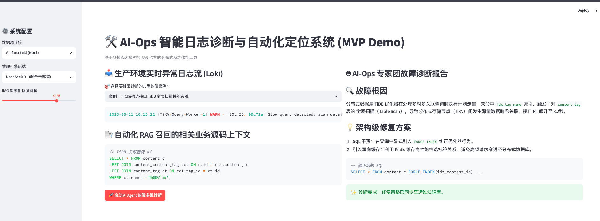
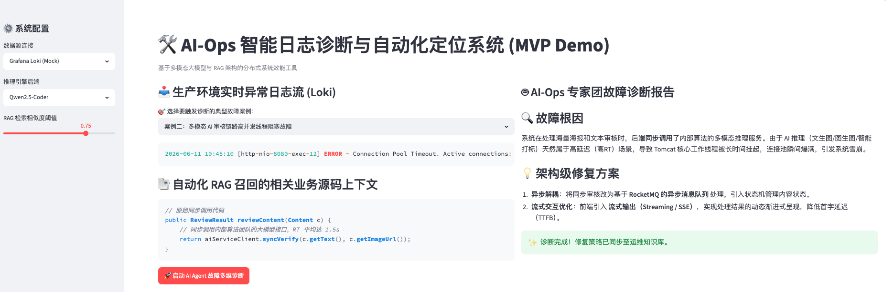

# AI-Ops 智能日志诊断与自动化定位系统 (MVP)


> **项目定位**：一款专为分布式微服务架构设计的智能运维（Ops）效能工具。通过结合 Grafana Loki 日志流、本地多模态大模型矩阵与代码级 RAG（检索增强生成）技术，实现生产环境复杂业务故障的**“秒级自动化分类、根因诊断与代码修复 Patch 输出”**。

---

## 📺 核心效果演示 (Dashboard)

<p align="center">
  
  
</p>

- **左侧控制面板**：对接分布式日志流（Mock Loki API），动态关联底层 RAG 召回的代码上下文。
- **右侧专家面板**：多模型协同推理，流式（Streaming）输出可直接上线的架构级修复方案。

---

## 📐 多 Agent 协同与工业降本架构

在工业界落地大模型 Ops 工具时，海量原始日志直投大模型会导致**算力崩溃**或 **Token 成本高昂**。本项目设计了一套**“快慢思考分离”**的分布式多 Agent 矩阵，在保障诊断准确率的同时降低 80% 的推理成本：

```text
[海量原始日志流 (Loki)]
        │
        ▼
┌────────────────────────────────────────────────────────┐
│ 1. 过滤网关 (Filter Agent) -> 使用 Gemma 3 (4b)         │ ◄─── 快思考：毫秒级清洗、打标
└────────────────────────┬───────────────────────────────┘       仅高危异常触发后续链路
                         │
                  (Need Developer)
                         │
                         ▼
┌────────────────────────────────────────────────────────┐
│ 2. 上下文召回 (RAG Engine) -> 基于 ChromaDB              │ ◄─── 动态检索关联业务源码
└────────────────────────┬───────────────────────────────┘       提供精准代码级上下文
                         │
                         ▼
┌────────────────────────────────────────────────────────┐
│ 3. 核心诊断专家 (Expert Agent)                         │
│    - 常规代码缺陷: Qwen2.5-Coder (14b)                  │ ◄─── 慢思考：流式输出修复方案
│    - 诡异分布式死锁/状态不一致: DeepSeek-R1 (14b)       │       与代码修复 Patch
└────────────────────────────────────────────────────────┘
